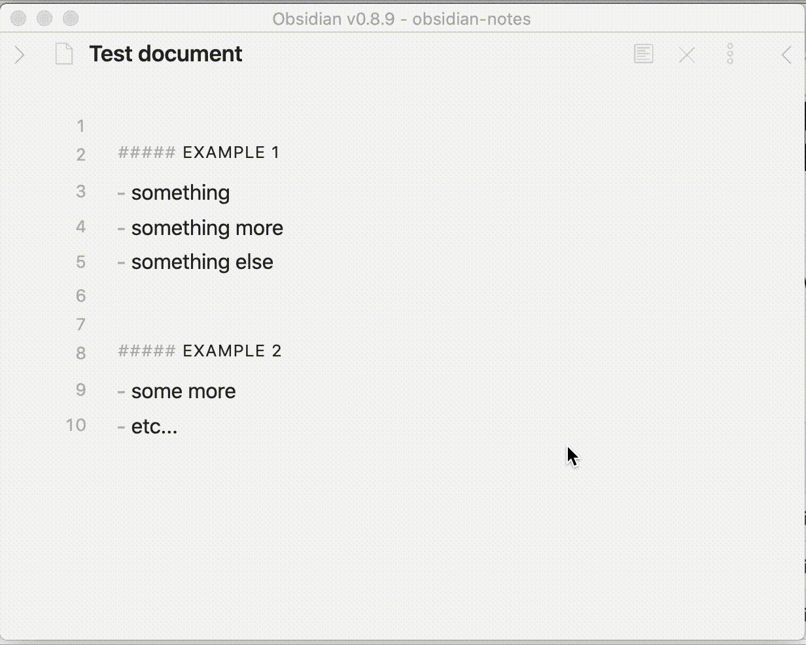

# obsidian-extract-note-plugin

A small plugin, to help me organize my notes easily. Kind of refactoring for your notes.



## Workflow

I use the daily notes, for recording all the events that happen during the day, sometimes I want to "refactor" and extract

That's what this plugin is about.

1. You select the text you want to extract into a new note
2. Look for a 3rd level header, this will be the title of the new note
3. Create a new note with the content of the selection, and replace with the embeded link

## Install

Plugins in obsidian are not still supported, you need to use a hack to load them named volcano.

```
npx volcano
```

now you can copy the plugins to your `~/volcano/plugins` folder.

```
make install
```
